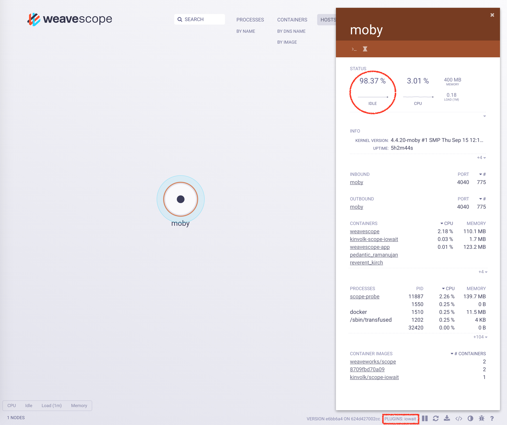

# Scope IOWait Plugin

The Scope IOWait plugin is a GO application that uses [`iostat`](https://linux.die.net/man/1/iostat) to provide **host-level** CPU IO wait or idle metrics in the [Weave Scope](https://github.com/weaveworks/scope) UI.



## How to Run Scope IOWait Plugin

### Using a pre-built Docker image

If you want to make sure of running the latest available version of the plugin, you pull the image from docker hub.

```
docker pull weaveworksplugins/scope-iowait:latest
```

To run the Scope IOWait plugin you just need to run the following command.

```
docker run --rm -ti \
	--net=host \
	-v /var/run/scope/plugins:/var/run/scope/plugins \
	--name weaveworksplugins-scope-iowait weaveworksplugins/scope-iowait:latest
```

### Kubernetes

If you want to use the Scope IOWait plugin in an already set up Kubernetes cluster with Weave Scope running on it, you just need to run:

```
kubectl apply -f https://github.com/weaveworks-plugins/scope-iowait/tree/master/deployments/k8s-iowait.yaml
```

### Recompiling an image

```
git clone git@github.com:weaveworks-plugins/scope-iowait.git
cd scope-iowait; make;
```

**Note** If Scope IOWait plugin has been registered by Scope, you will see it in the list of `PLUGINS` in the bottom right of the UI (see the rectangle in the above figure).
The measured value is showed in the *STATUS* section (see the circle in the above figure).

## How to use Scope IOWait Plugin

The plugin can show in the UI 2 metrics collected by _iostat_:

* Idle: show the percentage of time that the CPU or CPUs were idle and the system did not have an outstanding disk I/O request. This metrics is shown by the default.
* IO Wait: Show the percentage of time that the CPU or  CPUs  were idle  during  which  the system had an outstanding disk I/O request.

To switch between metrics you can use the controls. The `clock` icon (see green box in the above figure) switches to IO Wait metric and the `gears` icon switches to idle metric.
